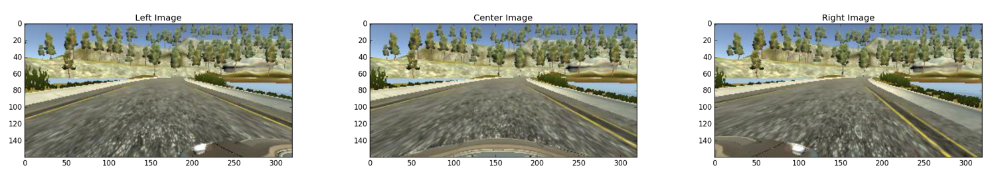
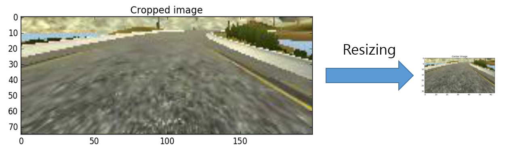
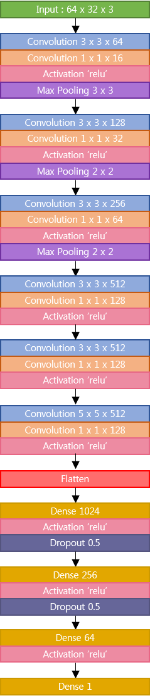

# Lab: Behavioral Cloning

## Introduction

Behavior cloning is a project of [Udacity's self driving car nanodegree class](https://www.udacity.com/drive). 
The goal of this project is to make the vehicle mimicking human control. 

###Steps of this project
* Use the simulator to collect data of good driving behavior
* Build, a convolution neural network in Keras that predicts steering angles from images
* Train and validate the model with a training and validation set
* Test that the model successfully drives around track one without leaving the road
* Summarize the results with a written report

###Environment of this project

**Software** 
* Windows7 (64bit)
* Python 3.5.2
* Anaconda 4.2.0
* Tensorflow 

**Hardware**
* CPU: Intel(R) Core(TM) i7-4790K CPU @ 4.00GHZ
* GPU: GeForce GTX 1080
* Memory: 8GB

**Data**
* [Sample dataset of track1 from udacity](https://d17h27t6h515a5.cloudfront.net/topher/2016/December/584f6edd_data/data.zip)

###Description of files
* model.h5: Save file of training weights
* model.json: Save file of training model
* drive.py: Autonomously drive the vehicle via trained model and data
* model.py: Train the model and weights
* making_data.py: Make training data pickle file with some image processing

###Simulator 

  

This great simulator was provided by Udacity. There are two modes and descriptions are following. 
* Training mode: Record the images as jpg and data(image path, steering, throttle, speed) as csv
* Autonomous mode: Autonomously drive the vehicle via trained model and data

Udacity open sources this self-driving-car simulator on [github](https://github.com/udacity/self-driving-car-sim)

--- 

## Making training data file with image processing

I used dataset which was provided by Udacity. 
* 8036 jpg images (Center, Left, Right each) 
* Steering
* Throttle
* Brake
* Speed 

###Image Processing

**Track 1**

    
  
   

 

**Track 2**

    
  
   

 

Udacity sample data only has the data from track 1 
But as you can see road of track2 is darker and there is shadow on the road. 
Therefore, I used some image processing techniques to solve this problem. 

##Processed Images
I used 6 different kinds of images for one image. 
* Original image
* Dark image (0.6)
* Dark image (0.3)
* Flipped image (Left & Right) 
* Flipped and dark image (0.6)
* Flipped and dark image (0.3)

The example images are as follows.

    
  
   

 

##Angle adjustment with 3 cameras
Also, in this project, there are three cameras. Therefore, I decided to use all three images for this project with angle adjustment.
The three images are as follows. 

    
  
   

 

I adjusted the angle of `left image with (+0.2)` and `right image with (-0.2)`
I also did 5 image processing to the left and right images.

##Image cropping
In this step, I cropped the images as `img = img[55:130, 60:260,:]` to all the images that I processed. 
The example of cropped images is as follows.

    
  
   

 

##Image resizing 
In this step, I resize the image to make the data set file lighter. 
I resized the cropped file `200 x 75` to `64 x 32` like the followed image

    
  
   

 

##Number of data adjusting 
Lastly, there were so many data that has steering angle 0 like as follows.

Steering | -    | 0    | +                       
---      | ---  | ---  | ---
---      |1,775 |4,361 |1,900 

Also, there are many data, so the pickle file can be too big. 
Therefore, I saved half of the - steering, + steering data and quarter of 0 steering data.
After all the processing, data set was made which has 52812 image data. 

###Training 

##Data distribution
I distributed the data as `Training set`, `Testing set`, `Validation set` as follows.

data | Training set | Testing set | Validation set                       
---  | ---          | ---         | ---
---  |45,154        |2,640        |5,018 

##Network modeling

To finish this project, I used `1 x 1 convolution` techniques.
Batch size was 256, epoch is 16, learning rate is 0.0001 and loss is mean squared error.
The network structure is as follows. 

    
  
   

 

###Result 
The vehicle is a little staggered, but the crash does not happen.
I only trained the images from track 1, but there the vehicle drives without crash in the track 2 either. 

     
    
    
     
    Result gif 
     

I will try to adjust the staggering via changing the model or tuning some parameters. 

