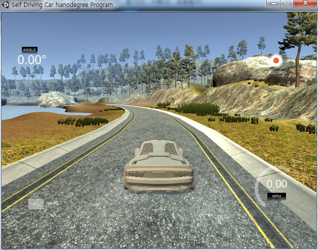
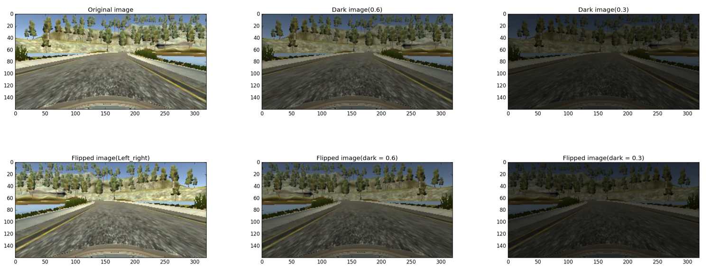

# Lab: Behavioral Cloning

## Introduction

Behavior cloning is a project of [Udacity's self driving car nanodegree class](https://www.udacity.com/drive). 
The goal of this project is to make the vehicle mimicking human control. 

###Steps of this project
* Use the simulator to collect data of good driving behavior
* Build, a convolution neural network in Keras that predicts steering angles from images
* Train and validate the model with a training and validation set
* Test that the model successfully drives around track one without leaving the road
* Summarize the results with a written report

###Environment of this project

**Software** 
* Windows7 (64bit)
* Python 3.5.2
* Anaconda 4.2.0
* Tensorflow 

**Hardware**
* CPU: Intel(R) Core(TM) i7-4790K CPU @ 4.00GHZ
* GPU: GeForce GTX 1080
* Memory: 8GB

**Data**
* [Sample dataset of track1 from udacity](https://d17h27t6h515a5.cloudfront.net/topher/2016/December/584f6edd_data/data.zip)

###Description of files
* model.h5: Save file of training weights
* model.json: Save file of training model
* drive.py: Autonomously drive the vehicle via trained model and data
* model.py: Train the model and weights
* making_data.py: Make training data pickle file with some image processing

###Simulator 

  

This great simulator was provided by Udacity. There are two modes and descriptions are following. 
* Training mode: Record the images as jpg and data(image path, steering, throttle, speed) as csv
* Autonomous mode: Autonomously drive the vehicle via trained model and data

Udacity open sources this self-driving-car simulator on [github](https://github.com/udacity/self-driving-car-sim)

--- 

## Making training data file with image processing

I used dataset which was provided by Udacity. 
* 8036 jpg images (Center, Left, Right each) 
* Steering
* Throttle
* Brake
* Speed 

###Image Processing

**Track 1**

    
  
   

 

**Track 2**

    
  
   

 

Udacity sample data only has the data from track 1 
But as you can see road of track2 is darker and there is shadow on the road. 
Therefore, I used some image processing techniques to solve this problem. 

##Processed Images
I used 6 different kinds of images for one image. 
* Original image
* Dark image (0.6)
* Dark image (0.3)
* Flipped image (Left & Right) 
* Flipped and dark image (0.6)
* Flipped and dark image (0.3)

The example images are as follows.

    
  
   

 

## Help
Remember that you can get assistance from your mentor, Forums (click the link on the left side of the classroom), or the [Slack channel](https://carnd.slack.com). You can also review the concepts from the previous lessons, or consult external documentation.
