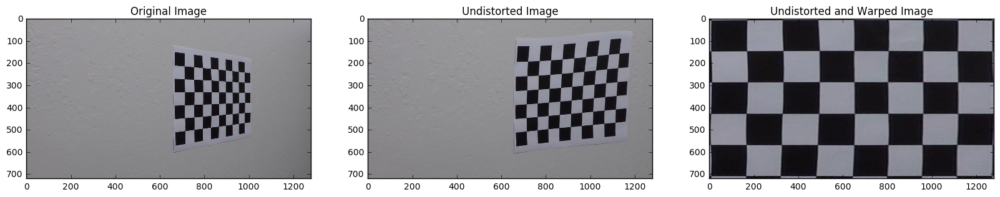
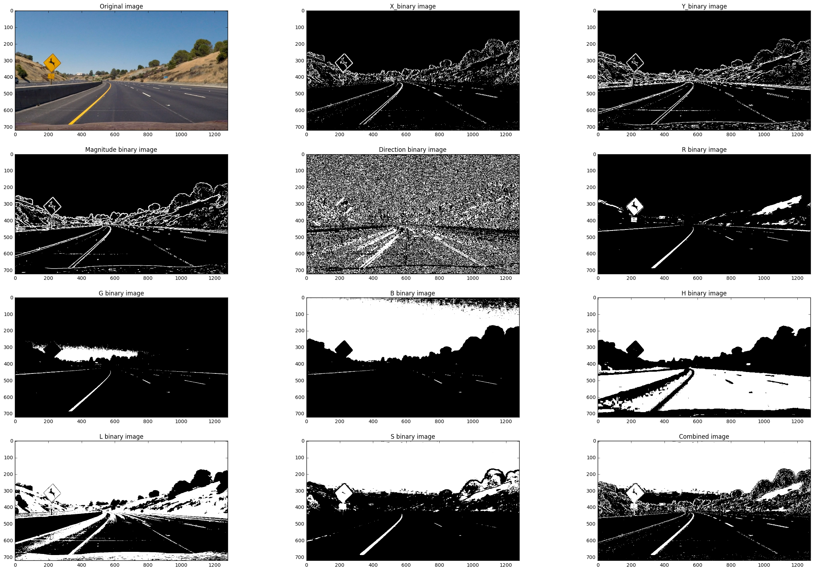

# Lab: Advanced Lane Finding
[](http://www.udacity.com/drive)


## Introduction

`Advanced Lane Finding` is a project of [Udacity's self driving car nanodegree class](https://www.udacity.com/drive). 
The goal of this project is to find lane line with various vision techniques. 


### Steps of this project
* Compute the camera calibration matrix and distortion coefficients given a set of chessboard images.
* Apply a distortion correction to raw images.
* Use color transforms, gradients, etc., to create a thresholded binary image.
* Apply a perspective transform to rectify binary image ("birds-eye view").
* Detect lane pixels and fit to find the lane boundary.
* Determine the curvature of the lane and vehicle position with respect to center.
* Warp the detected lane boundaries back onto the original image.
* Output visual display of the lane boundaries and numerical estimation of lane curvature and vehicle position.


### Environment of this project

**Software** 
* Windows7 (64bit)
* Python 3.5.2
* Anaconda 4.2.0

**Hardware**
* CPU: Intel(R) Core(TM) i7-4790K CPU @ 4.00GHZ
* GPU: GeForce GTX 1080
* Memory: 8GB

--- 

## Camera calibration (Chessboard)

For this project, `Camera Calibration` is the first step. <p>
Steps of camera calibration is as follows.
* Make the image as a grayscale image 
* Find corners of chessboard image with `cv2.findChessboardCorners` function
* With the corners, define the `Object points` and `Image points`
* Use `cv2.calibrateCamera` function to find Camera matrix and distortion coefficients
* Undistort the images with `cv2.undistort` function  
* Define the 4 source points and 4 desired points
* Do the perspective transform with `cv2.getPerspectiveTransform` function to make image as top down view

### Camera Calibration Result 
<div align="center">
    
</div> 

--- 

## Image Processing to Test Images
The process of this project is as follows 
<div align="center">
    
</div> 

### Load and Undistort Image
* Load original image with `mpimg.imread` (matplotlib.img)
* Undistort image with `Camera matrix` and `Distortion coefficient` which obtained from chessboard camera calibration 

The original image and undistorted image is as follows. 
<div align="center">
    
  <p> <br> </p>
</div> 

### Use Gradient and Color Channels to Find Lane Lines 
I used 4 different kinds of `Gradient` and 6 different kinds of `Color channels`  
**Gradients**
* Thresholded X-derivative   
* Thresholded Y-derivative
* Thresholded Magnitude 
* Thresholded Gradient Direction 

**ColorChannels** 
* Red 
* Green 
* Blue 
* Hue 
* Saturation 
* Lightness    

The example images are as follows.
<div align="center">
    
  <p> <br> </p>
</div> 

First,  I used gradient like as follows 
* combined_gradient[((mag_binary == 1) | (dir_binary == 1)) & ((x_binary == 1) | (y_binary==1))] = 1

Second, I used color channels as follows 
* combined_color[((R_binary == 1) & (G_binary == 1)) | ((S_binary == 1) & (L_binary == 1))] = 1 

I connected the both with `and` 

As a result, the Combined Binary equation is as follows 

**combined_binary[((mag_binary == 1) | (dir_binary == 1)) & ((x_binary == 1) | (y_binary==1)) & ((R_binary == 1) & (G_binary == 1)) | ((S_binary == 1) & (L_binary == 1)) | (x_binary == 1)] = 1**

The result images of Combined Gradient, Combined Color Channels, Combined Result are as follows 
<div align="center">
    
  <p> <br> </p>
</div> 

### Perspective Transform 
I used perspective transform with 4 source points and 4 desired points. The points are as follows. 

```
# set the corner points 
corners = [(img_size[0]/14,img_size[1]),\
            (img_size[0] - img_size[0]/14, img_size[1]),\
            (img_size[0]/2 - img_size[0]/21, img_size[1]/2 + img_size[1]/8),\
            (img_size[0]/2 + img_size[0]/21, img_size[1]/2 + img_size[1]/8)]

# Define the 4 source points 
src = np.float32([corners[0],
                  corners[nx-1],
                  corners[nx*ny - 1],
                  corners[nx*ny - nx]])

# Define the 4 destination points 
dst = np.float32([[img_size[0]/6, img_size[1]], 
                  [img_size[0] - img_size[0]/6, img_size[1]], 
                  [img_size[0] - img_size[0]/6, 0], 
                  [img_size[0]/6, 0]])
```

| Source        | Destination   | 
|:-------------:|:-------------:| 
|   91, 720     |  213, 720     | 
| 1189, 720     | 1067, 720     |
|  701, 450     | 1067, 0       |
|  579, 450     |  213, 0       |

The result of Perspective Transform is as follows. 
<div align="center">
    
  <p> <br> </p>
</div> 

### Finding Lane Lines 
Apply histogram at the bottom half of the warped binary image. The result is as follow 
<div align="center">
    
  <p> <br> </p>
</div> 

The max point of histogram at the leftside of the image is `Left base point` and max point at the rightside of the image is `Right base point` 

I used `Sliding Window` technique to find lane lines

**Sliding Window** 
* Find left and right base points according to the max points of histogram.
* Find non-zeros values in the region between `base point +- margin` and `window height`
* If the number of non-zero values in the region is over the parameter `min_pixel`, 
 then set the mean value of the left lane reion and right lane region as a new left and right base point
* If the number of non-zeros values in the region is less then `min_pixel`, then base points are not updated 
* Slide the window to the next region 

But there was `PROBELM` when I used sliding window.

**Problem**

If the number non-zeros-values are less than min_pixel, the `base points are not changed`.
The example image is as follows. 
<div align="center">
    
</div> 

**Solution**

* Saved the difference of the prior base line changes
* If there was a few of non-zero pixels, instead of maintaining base points, I moved the base point according to the mean of saved difference
of the base line changes. 

The example image is as follows.
<div align="center">
    
</div> 

The code is as follows. 
```
    window_num = 10
    window_height = np.int(warped.shape[0]/window_num)

    margin = 100
    
    min_pixel = 20
    
    # Identify the x and y positions of all nonzero pixels in the image
    nonzero = warped.nonzero()
    nonzeroy = np.array(nonzero[0])
    nonzerox = np.array(nonzero[1])

    left_lane_index  = []
    right_lane_index = []
    
    left_lane_check = []
    right_lane_check = []
    
    n_check = 3
    
    # Step through the windows one by one
    for window in range(window_num):
        # Identify window boundaries in x and y (and right and left)
        win_y_low = warped.shape[0] - (window+1)*window_height
        win_y_high = warped.shape[0] - window*window_height
        
        win_xleft_low = left_peak_current - margin
        win_xleft_high = left_peak_current + margin
        
        win_xright_low = right_peak_current - margin
        win_xright_high = right_peak_current + margin

        # Identify the nonzero pixels in x and y within the window
        good_left_inds = ((nonzeroy >= win_y_low) & (nonzeroy < win_y_high) & (nonzerox >= win_xleft_low) & (nonzerox < win_xleft_high)).nonzero()[0]
        good_right_inds = ((nonzeroy >= win_y_low) & (nonzeroy < win_y_high) & (nonzerox >= win_xright_low) & (nonzerox < win_xright_high)).nonzero()[0]
        
        # Append these indices to the lists
        left_lane_index.append(good_left_inds)
        right_lane_index.append(good_right_inds)
        
        # If you found > minpix pixels, recenter next window on their mean position
        if len(good_left_inds) > min_pixel:
            left_peak_current = np.int(np.mean(nonzerox[good_left_inds]))
        if len(good_right_inds) > min_pixel:        
            right_peak_current = np.int(np.mean(nonzerox[good_right_inds]))
        
        # Calculate difference of current lane peak and former lane peak 
        if window > 0:
            diff_left_X = left_peak_current - left_peak_old
            diff_right_X = right_peak_current - right_peak_old
            left_lane_check.append(diff_left_X)
            right_lane_check.append(diff_right_X)

        # If check data are cumulated and there is no data, current peak is not fix and moved via mean of the check list 
        if len(left_lane_check) == n_check:
            left_mean = sum(left_lane_check) / len(left_lane_check)
            right_mean = sum(right_lane_check) / len(right_lane_check)
            
            if diff_left_X == 0:
                del left_lane_check[n_check - 1]
                left_lane_check.append(left_mean)
                left_peak_current += left_mean
            
            if diff_right_X == 0:
                del right_lane_check[n_check - 1]
                right_lane_check.append(left_mean)
                right_peak_current += right_mean

            del left_lane_check[0]
            del right_lane_check[0]
        
        left_peak_old = left_peak_current
        right_peak_old = right_peak_current  
```

My `Lane finding result` image is as follows.
<div align="center">
    
</div>  

### Road curvature 
The equation of `Radius of curvature` is as follows 
<div align="center">
    
</div>  

I used the function `np.polyfit` to find 2nd order polynomial equation coefficients
The code which I used is as follows 
```
# ------------------------------ Calculate road curvature ------------------------------ 
R_curvature = np.power(1 + np.power(2 * left_fit[0] * img_size[1] + left_fit[1], 2), 3/2) / abs(2 * left_fit[0])
```
As the Udacity noticed to me, the first left curve's radius of curvature was almost 1000, so I think this value makes sense.

### Offset from lane center 
* I assumed that lane width is `3.7m` which is U.S standard. 
* I found the left and right lane base point as pixel via histogram.
* Then I calculated the center point of both lane base points 
* I obtained distance of the point and center of the image.
* Therefore, I can calculate the distance of the vehicle offset from the lane center.
  
Explanation image is as follows. 
<div align="center">
    
</div>  

**Future work**

Move the source points according to the offset from the center. 

### Back to Road! 
I used `fillpoly` function to color the lane region. 

Also, I used `Minv` to warp the lane region back to the original image. 
The result is as follow. 
<div align="center">
    
</div>  

--- 
## Result 
The result gif file of project video is as follows. 
<div align="center">
    
</div>  

**Future Work**
`Challenge video` and `Harder challenge video` 


