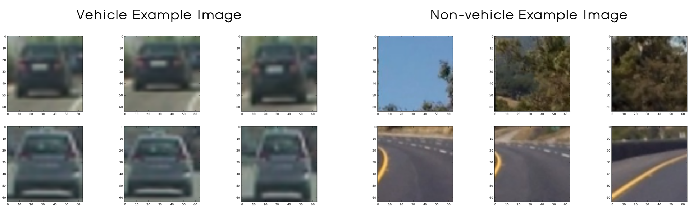
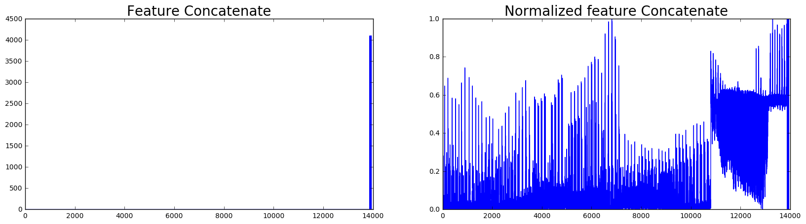
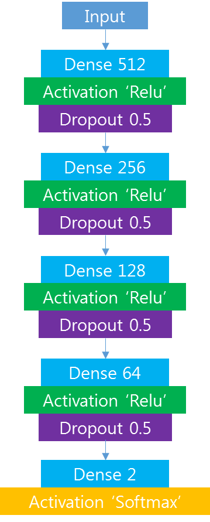

# Lab: Vehicle Detection and Tracking 
[](http://www.udacity.com/drive)


---
## Introduction

`Vehicle Detection and Tracking` is a project of [Udacity's self driving car nanodegree class](https://www.udacity.com/drive). 
The goal of this project is to find vehicle on the road and track it  

>### Steps of this project
>* Perform a Histogram of Oriented Gradients (HOG) feature extraction on a labeled training set of images and train a classifier Linear SVM classifier
>* Optionally, you can also apply a color transform and append binned color features, as well as histograms of color, to your HOG feature vector. 
>* Note: for those first two steps don't forget to normalize your features and randomize a selection for training and testing.
>* Implement a sliding-window technique and use your trained classifier to search for vehicles in images.
>* Run your pipeline on a video stream (start with the test_video.mp4 and later implement on full project_video.mp4) and create a heat map of recurring detections frame by frame to reject outliers and follow detected vehicles.
>* Estimate a bounding box for vehicles detected.


### Environment of this project 

**Software** 
* Windows7 (64bit)
* Python 3.5.2
* Anaconda 4.2.0

**Hardware**
* CPU: Intel(R) Core(TM) i7-4790K CPU @ 4.00GHZ
* GPU: GeForce GTX 1080
* Memory: 8GB

--- 

## Data 
Here are links to the labeled data for [vehicle](https://s3.amazonaws.com/udacity-sdc/Vehicle_Tracking/vehicles.zip) and [non-vehicle](https://s3.amazonaws.com/udacity-sdc/Vehicle_Tracking/non-vehicles.zip) examples to train your classifier.  These example images come from a combination of the [GTI vehicle image database](http://www.gti.ssr.upm.es/data/Vehicle_database.html), the [KITTI vision benchmark suite](http://www.cvlibs.net/datasets/kitti/), and examples extracted from the project video itself.  

I used `GTI vehicle image database` as my dataset. The example image of vehicle and non=vehicle image are as follows. 
<p align="center">
     
</p>

--- 

## Features 

**Features for this project is as follows** 
* `Histogram of Oriented Gradient(HOG)`
* `Color Histogram` and `Spatial Binning of Color` 


### HOG  

First feature for this project is HOG. It uses gradient of image, so it can extract vehicle image's feature 
regardless of the color. Also, I tested HOG performance with many different color channels. The color spaces
that I tested are as follows.
* GRAY 
* RGB
* HSV 
* HLS
* YUV 
* YCrCb 

I used all channels of color spaces except GRAY.  
Result of `GRAY`, `HLS` and `RGB` was good and I used `HLS` for this project. 

The parameters that I used for HOG is as follows 

Parameter       | Value
--------        | ---
orient          | 9
pix per cell    | 8
cell per block  | 4
color space     | HLS 

The example of image and HOG visualization is as follows.
<div align="center">
    
</div> 

### Color Features 
I used `Histogram of Color` and `Spatial Binning of Color` as features. 
The parameters for those features are as follows. 

Parameter     | Value
--------      | ---
color space   | YCrCb
spatial size  | (32, 32)
bins          | 32
range hist    | (0, 256) 

The graph of features are as follows. 
<div align="center">
    
</div> 

### Normalize Features 
But as you can see, the value range of feature's magnitude is so different. 
If I just concatenate them, one feature can be more dominant than other features. 
To prevent this, I normalized all the features as 0 to 1. 

The image of before can after of normalization is as follows. 
<div align="center">
    
</div>  

--- 

## Classifier
I tested `Support Vector Machine` and `Neural Network` as a classifier. 
Performance of neural network was better than SVM, so I used `Neural Network` as a classifier for this project. 
The structure of neural network is as follows. 

<div align="center">
    
</div> 

The parameters for Neural network are as follows. 

Parameter        | Value
--------         | ---
optimizer        | adam
loss function    | categorical_crossentropy
epoch            | 30
batch size       | 500 
validation split | 0.1

--- 

## Sliding Window 

I used sliding window technique to find vehicle. 

In the image, if the vehicle is far from camera, size of vehicle is small. 
Also, if the vehicle is close from camera, size of vehicle is small. 
Therefore, I used multi-scale windows to find various size of vehicles. 
The example image is as follows. 
<div align="center">
    
</div> 

My result of multi-scale window and vehicle finding result is as follows. 
<div align="center">
    
</div> 

There were some challenges to solve. 
* False positive 
* Overlapping detection 

The example image is as follows. 
<div align="center">
    
</div> 

> To solve the challenges I used 4 techniques. 
>* Adjust neural network output threshold
>* Heatmap 
>* Save the box of interest 
>* Label 

### Adjust Neural Network Output Threshold
If I just used softmax and found the window which has more possibility of vehicle, there were few false-positive windows. 
Therefore, I used the windows which has more than 85% possibility of vehicle.
```python
if pred_NN[0,1] > 0.85:
    vehicle_window.append(window)
``` 

### Heatmap
I used heatmap as a threshold to find vehicles. 
The test video and its heatmap result is as follows. 
<div align="center">
    
    
</div> 

I saved 15 frame's heatmap value and sum all of the heatmap (heat_map_sum). 
Then I found the window which has a heat_map_sum pixel value more than 10 and add them to box of interest. 

The code of this part is as follows. 
```python
heatmap = add_heat(img_heat_map, vehicle_window)

if len(process_image.heat_map_list) >= 15:
    del process_image.heat_map_list[0]
    
process_image.heat_map_list.append(heatmap)

for m in process_image.heat_map_list:
    heat_map_sum += m

window_heatmap = []
for box in vehicle_window:
    if np.max(heat_map_sum[box[0][1]:box[1][1], box[0][0]:box[1][0]]) > 10:
        window_heatmap.append(box)
```


### Box of Interest
I saved the list of 6 set of boxes of interest and find the windows which are more than 2 in the list.
This helps to track the vehicle because it used saved windows. 
With this technique I could find vehicle windows even if window lost vehicle in a frame. 

The code of this part is as follows. 
```python
# Use box of interest 
# If window has more heat value than threshold, add it to box of interest list 
if len(window_heatmap) > 0:
    process_image.interest_boxes.extend(window_heatmap)
    process_image.len_interest_boxes.append(len(window_heatmap))

# If the number of boxes of interest is more than threshold, then add it to final window list 
window_thresh = []
if len(process_image.interest_boxes) > 0:
    for interest_box in process_image.interest_boxes:
        if process_image.interest_boxes.count(interest_box) >= 2 and interest_box not in window_thresh:
            window_thresh.append(interest_box)
            
if len(process_image.interest_boxes) > 0:
    if len(process_image.len_interest_boxes) > 6:
        for len_del_box in list(range(process_image.len_interest_boxes[0])):
            del process_image.interest_boxes[0]
        del process_image.len_interest_boxes [0]
```

### Label 
Finally, I used `scipy.ndimage.measurements.label` to combine the overlapping windows. 
The result image after all the techniques is as follows. 
<div align="center">
    
</div> 

--- 

## Result 
Final result video is as follows. 
<div align="center">
    
    
</div> 

---

## Discussion 

The goal of this project is to `find vehicle on the road`. 

For this project, I learned used `Histogram of Oriented Gradient`, `Histogram of Color` and 
`Spatial Binning of Color` as feature of classifier. 

I tested features with various `color channel` such as GRAY, RGB, HSV, HLS, YUV, YCrCb. 

I used `Neural Network` as a classifier and train it with `GTI vehicle image database`

Finally, I used `Sliding window` to find vehicle windows. Then I used some techniques to solve the challenges such as false-posivie and overlapping windows.

The result of project video is good, but there is some missing in few frames. 
In this project, it was very hard to solve the false-positive. 
If threshold is too strict, it was also hard to find the correct window. 
On the otherhand, if the threshold is too much, the false-positive window can be judged as a correct window. 
I saved the boxes of interest and used them not to lose the correct window if window was omitted in a frame.
I think the result might be better if I change some parameters, combination of color channels, structure of neural network.    


