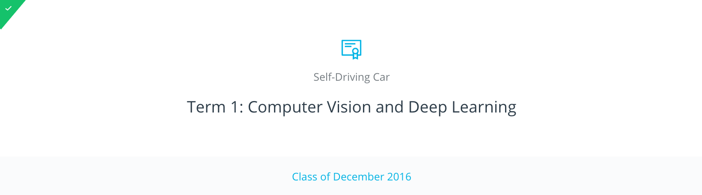

# Udacity_SelfDrivingCar

## Introduction 

This repository is for projects of [Udacity's self driving car nanodegree class](https://www.udacity.com/drive). 
:blue_car:

## Projects 

This course has 3 terms. 
* Term 1: Computer Vision and Deep Learning 
* Term 2: Sensor Fusion, Localization, and Control
* Term 3: Path Planning, Concentrations, and Systems

### Term 1
Main topic of Term 1 is `Computer Vision and Deep learning` 

The contents of the course are as follows. 📔
* Introduction to Neural Network

* Miniflow

* Introduction to Tensorflow 

* Deep Neural Network

* Convolutional Neural Network

* Keras

* Transfer Learning

* Machine Learning and Stanley 

* Support Vector Machines 

* Decision Trees

  ​

The projects of the course are as follows. 📋
* Finding Lane lines 
* Traffic Sign Classifier 
* Behavioral Cloning 
* Advanced Lane Finding 
* Vehicle Detection and Tracking 

I finished all the projects of Term 1!! Yeah~~~ 🎉🎉

### Term 2

Main topic of Term 2 is `Sensor fusion, Localization and Control` 

The contents of the course are as follows. 📔

- Introduction and Sensors

- Kalman Filters

- Lidar and Radar Fusion with Kalman Filters in C++

- Unscented Kalman Filter

- Localization Overview

- Markov Localization

- Motion Models

- Particle Filters

- Implementation of a Particle Filter 

- PID Control

- Model Predictive Control

  ​

The projects of the course are as follows. 📋

- Extended Kalman Filter 
- Unscented Kalman Filter
- Kidnapped Vehicle (Localization) 
- PID Control
- Model Predictive Control 

For now, I am working on projects of term 2!! :pencil2: