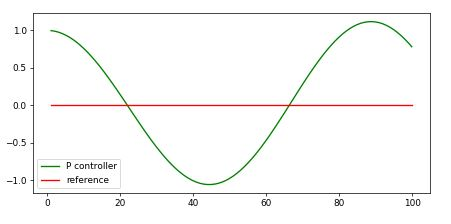
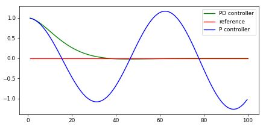
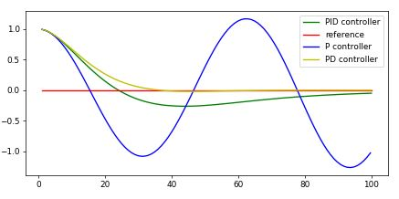

# Lab: PID - Control
[](http://www.udacity.com/drive)


## Introduction

`PID Control` is a project of [Udacity's self driving car nanodegree class](https://www.udacity.com/drive). 
The goal of this project is control the vehicle to follow the reference path. 

### Environment of this project

**Software** 
* Ubuntu 16.04 (64bit)

* cmake >= 3.5

* All OSes: [click here for installation instructions](https://cmake.org/install/)

* make >= 4.1

  - Linux: make is installed by default on most Linux distros
  - Mac: [install Xcode command line tools to get make](https://developer.apple.com/xcode/features/)
  - Windows: [Click here for installation instructions](http://gnuwin32.sourceforge.net/packages/make.htm)

* gcc/g++ >= 5.4

  - Linux: gcc / g++ is installed by default on most Linux distros
  - Mac: same deal as make - [install Xcode command line tools]((https://developer.apple.com/xcode/features/)
  - Windows: recommend using [MinGW](http://www.mingw.org/)

* [uWebSockets](https://github.com/uWebSockets/uWebSockets)

  - Run either `./install-mac.sh` or `./install-ubuntu.sh`.

  - If you install from source, checkout to commit `e94b6e1`, i.e.

    ```
    git clone https://github.com/uWebSockets/uWebSockets 
    cd uWebSockets
    git checkout e94b6e1
    ```

    Some function signatures have changed in v0.14.x. See [this PR](https://github.com/udacity/CarND-MPC-Project/pull/3) for more details.

* Simulator. You can download these from the [this page](https://github.com/udacity/self-driving-car-sim/releases) in the classroom.

There's an experimental patch for windows in this [PR](https://github.com/udacity/CarND-PID-Control-Project/pull/3)


**Hardware**

* CPU: Intel(R) Core(TM) i7-4790K CPU @ 4.00GHZ
* GPU: GeForce GTX 1080
* Memory: 8GB


### Basic Build Instructions

1. Clone this repo.
2. Make a build directory: `mkdir build && cd build`
3. Compile: `cmake .. && make`
4. Run it: `./pid`. 

---

## PID - Control

In this project, I can get `Cross track error(cte)`, `Steering angle`, `Speed` from simulator. 

At first, I need to describe about P, I, D component of the PID control algorithm. 


#### P - Control 

- Proportional term
- It controls steering angle proportional to cte

```python
# P-Control
# tau: p-gain, cte: cross track error
steering_angle = -tau * cte
```

- It has oscillation problem!! 
- Result of P-control



#### D - Control

- Derivative term
- It solves oscillation problem

```python
# PD - Control
# tau_p: p-gain, tau_d: d-gain
d_cte = (cte - cte_old)
steering_angle = - tau_p * cte - tau_d * d_cte
```

- Result of PD-control

  


#### I - Control

- Integral term
- It solves systematic bias

```python
# PID - Control
# tau_p: p-gain, tau_d: d-gain, tau_i: i-gain
d_cte = (cte - cte_old) 
cte_sum += cte

steering_angle = -tau_p * cte -tau_d * d_cte - tau_i * cte_sum
```

- Result of PID control




## Simulation Result

I used this control technique to vehicle simulator which is provided by Udacity 

I set up the parameters manually. 

The simulator had to be ended at every trial, so I couldn't use optimization technique like twiddle, SGD, etc.

At first, I set P-gain to make vehicle track the reference path. However, it has some oscillation. 

Therefore, I adjusted D-gain to solve the oscillation problem. 

Lastly, I adjusted I-gain.

Also, I used speed to adjust PID gains. If the speed goes up, vehicle needs to be controlled  quickly. 

Therefore, I set the pid gains as follows. 

```c++
p_update = p_gain + p_gain * (speed / 50.0);
i_update = i_gain + i_gain * (speed / 50.0);
d_update = d_gain + d_gain * (speed / 50.0);
```

Also, I controlled vehicle throttle according to the steering angle and cte. 

Vehicle decelerate if angle or cte is high.

```c++
// Default throttle is 0.5
double throttle = 0.4;

// If angle is high or cte is high then decel
if (fabs(angle) > 5 || fabs(cte) > 0.5)
{
throttle = 0.1;
}
```

As a result, average cte for 1 lap is about 0.37. 

No tire left track surface. Also, there were no pop up onto ledges or roll over.  