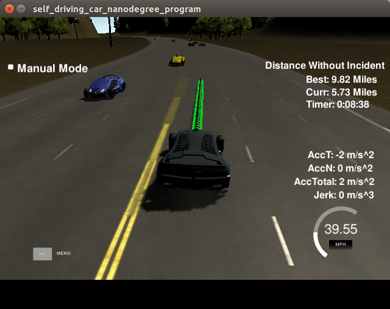

# Path Planning Project
## Introduction

The goal of this project is to design a path planner that is able to create `smooth`, `safe` paths for the car to follow along 3 lane highway with other traffics. The conditions for successful path planner are as follows.

- Keep inside its lane
- Avoid hitting other cars
- Pass slower moving traffic


### Environment of this project

**Software**

- Windows7 (64bit)
- Python 3.5.2
- Anaconda 4.2.0
- Tensorflow-GPU 1.3.0

**Hardware**

- CPU: Intel(R) Core(TM) i7-4790K CPU @ 4.00GHZ
- GPU: GeForce GTX 1080
- Memory: 8GB


### Simulator 

You can download the Term3 Simulator which contains the Path Planning Project from the [releases tab](https://github.com/udacity/self-driving-car-sim/releases).


## Implementation

### Possible Behaviors and actions

- Lane Keeping
  - Keep its current lane and follow it.
- Right and Left Change Ready
  - Ready for changing lane. 
  - Host vehicle just follows front vehicle, if cost of lane change is high 
- Right and Left Change
  -  If there is no other vehicle on the next lane in the particular range, host vehicle changes its current lane to the next


### Cost design

- Lane Keeping
  - Cost of lane keeping is `10 / distance between front vehicle and host vehicle`

```c++
double min_front_s = 9999999;
for(int j = 0; j < other_on_current_lane.size(); j++) {
  if (other_on_current_lane[j][5] > car_s) {
    if (other_on_current_lane[j][5] < min_front_s) {
      min_front_s = other_on_current_lane[j][5];
      front_vehicle_vel = 2.2369 * sqrt(pow(other_on_current_lane[j][3], 2) + pow(other_on_current_lane[j][4], 2));
    }
  }
}
```

- Lane Change Ready
  - If host vehicle is on the left or right lane, change ready for that lane is very high ( = 100)
  - Normally, basic cost for lane change ready is 0.3 and if there are other vehicles on the target lane, there is additional cost per other vehicle. 

```C++
if (current_lane == 3) {
  cost = 100;
} else {
  if (current_lane == 2){
    other_on_right_lane = vehicle_on_lane3;
  } else {
    other_on_right_lane = vehicle_on_lane2;
  }
  cost = 0.3;
  for(int j = 0; j < other_on_right_lane.size(); j++) {
    if (other_on_right_lane[j][5] > car_s - 20 && (other_on_right_lane[j][5] < car_s + 50)){
      cost += 0.1;
    }
  }
}
```


- Lane Change 
  - If host vehicle is lane changing, cost is low at first. However, if host vehicle gets closer to target lane, cost goes up. 
  - If there is other vehicle on the next at the target lane, cost of lane change is very high (=100)

```C++
if (mode == "Left_Change"){
  cost = 0.5 / abs(target_end_d - car_d);
} else {
  for (int j = 0; j < other_on_left_lane.size(); j++){
    if (other_on_left_lane[j][5] < car_s + 20 && other_on_left_lane[j][5] > car_s - 10) {
      cost = 100;
    }
  }
}
```


After all this, select minimum cost action among all possible actions 

```C++
double min_action_cost = 99999999;
for(int i = 0; i < possible_actions.size(); i++){
  if (costs[i] < min_action_cost){
    min_action_cost = costs[i];
    mode = possible_actions[i];
  }
}
```


### Path Generation

- Lane Keeping

  - At the lane keeping, target lane is current lane of host vehicle. 

  ```C++
  // Lane Keeping
  if (mode == "Lane_Keeping"){
    check_start_lane_change = 0;
    if (current_lane == 1) {
      target_d = 2;
    } else if(current_lane == 2) {
      target_d = 6;
    } else {
      target_d = 10;
    }
  ```

- Lane Change

  - Gradually move `target_d` to target lane center. 

  ```c++
  else if (mode == "Left_Change") {
                // Lane Change
                if (end_path_d > target_end_d){
                  target_d = target_d - 0.1;
                }

                target_speed = target_speed_default;
  ```

- Lane Change Ready

  - If there is other vehicle on the target lane, target speed is little bit less than front vehicle.

  ```c++
  else if (mode == "Left_Change_Ready"){
                check_start_lane_change = 0;

                vector<vector<double>> other_on_left_lane;
                if (current_lane == 2){
                  other_on_left_lane = vehicle_on_lane1;
                } else {
                  other_on_left_lane = vehicle_on_lane2;
                }

                for(int j = 0; j < other_on_left_lane.size(); j++){
                  if (other_on_left_lane[j][5] > car_s - 20 && other_on_left_lane[j][5] < car_s + 20){
                    target_speed = front_vehicle_vel - 1;
                  }
                }
  ```


After calculating all target s and d, convert it to xy coordinate.  `push_back`  the target x, y after previous path. 

```C++
vector<double> target_xy;
target_xy = getXY(target_s, target_d, map_waypoints_s, map_waypoints_x, map_waypoints_y);

double pos_x;
double pos_y;
double angle;
int path_size = previous_path_x.size();

for(int i = 0; i < path_size; i++)
{
  next_x_vals.push_back(previous_path_x[i]);
  next_y_vals.push_back(previous_path_y[i]);
}

if(path_size == 0)
{
  pos_x = car_x;
  pos_y = car_y;
  angle = deg2rad(car_yaw);
}
else
{
  pos_x = previous_path_x[path_size-1];
  pos_y = previous_path_y[path_size-1];

  double pos_x2 = previous_path_x[path_size-2];
  double pos_y2 = previous_path_y[path_size-2];
  angle = atan2(pos_y-pos_y2,pos_x-pos_x2);
}

int num_update = num_points - path_size;
double dx = (target_xy[0] - pos_x)/(num_update);
double dy = (target_xy[1] - pos_y)/(num_update);
for(int i = 0; i < num_points - path_size; i++)
{
  next_x_vals.push_back(pos_x + dx);
  next_y_vals.push_back(pos_y + dy);
  pos_x += dx;
  pos_y += dy;
}
```


However, target path is very rough and it makes high acceleration or jerk. Therefore, I smoothened path with `Bezier Curve`. I used 7th order Bezier curve to smoothen the target path. 

```c++
// Smoothing the Vehicle Using Bezier Curve
double t = 0;
double delta_t_bezier = 1 / (num_points - 1);
double bezier_x;
double bezier_y;

for(int i = 0; i < num_points; i++) {

  bezier_x = pow((1-t), 7) * next_x_vals[0] + 7 * pow((1-t), 6) * t * next_x_vals[7] + 21 * pow((1-t), 5) * pow(t,2) * next_x_vals[14] + 35 * pow((1-t), 4) * pow(t,3) * next_x_vals[21]
    + 35 * pow((1-t), 3) * pow(t,4) * next_x_vals[28] + 21 * pow((1-t), 2) * pow(t,5) * next_x_vals[35] + 7 * (1-t) * pow(t,6) * next_x_vals[42] + pow(t,7) * next_x_vals[49];
  bezier_y = pow((1-t), 7) * next_y_vals[0] + 7 * pow((1-t), 6) * t * next_y_vals[7] + 21 * pow((1-t), 5) * pow(t,2) * next_y_vals[14] + 35 * pow((1-t), 4) * pow(t,3) * next_y_vals[21]
    + 35 * pow((1-t), 3) * pow(t,4) * next_y_vals[28] + 21 * pow((1-t), 2) * pow(t,5) * next_y_vals[35] + 7 * (1-t) * pow(t,6) * next_y_vals[42] + pow(t,7) * next_y_vals[49];

  next_x_bezier.push_back(bezier_x);
  next_y_bezier.push_back(bezier_y);

  t = t + delta_t_bezier;
}
```

 

## Result




As you can see above, the distance without incident result is as follows.

- Best: 9.82 miles


Very rarely, there is max acceleration warning at the very stiff curve road.  Therefore, I added velocity decreasing code for curve road, but it still happens. Maybe, it's because of the waypoint of the simulator. 

However, host vehicle can drive more than 20 loops without collision or serous incident!! :smile: 