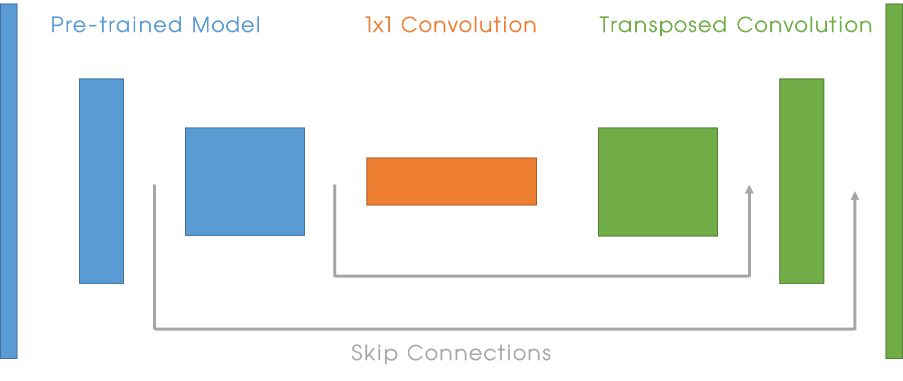
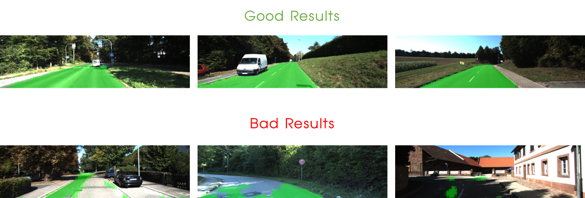

# Semantic Segmentation
## Introduction

The goal of this project is to implement `Sementic Segmentation`  which labels the pixel of a road in images with Fully Convolutional Network (FCN).  FCN is a network which is consist of **only convolutional layers**. For implementation, following 3 techniques will be used.

-  1x1 convolution
-  Upsampling
-  Skip connection


### Environment of this project

**Software** 

- Windows7 (64bit)
- Python 3.5.2
- Anaconda 4.2.0
- Tensorflow-GPU 1.3.0

**Hardware**

- CPU: Intel(R) Core(TM) i7-4790K CPU @ 4.00GHZ
- GPU: GeForce GTX 1080
- Memory: 8GB

**Data**

- [Kitti Road dataset](http://www.cvlibs.net/datasets/kitti/eval_road.php) : [Download](http://www.cvlibs.net/download.php?file=data_road.zip)


## Implementation

The `Network Structure` of this FCN is as follows. 




### Pre-trained Model

 The pre-trained model is famous `VGG16` model. Loading VGG model code is as follows. 

```python
def load_vgg(sess, vgg_path):
    """
    Load Pretrained VGG Model into TensorFlow.
    :param sess: TensorFlow Session
    :param vgg_path: Path to vgg folder, containing "variables/" and "saved_model.pb"
    :return: Tuple of Tensors from VGG model (image_input, keep_prob, layer3_out, layer4_out, layer7_out)
    """
    # TODO: Implement function
    #   Use tf.saved_model.loader.load to load the model and weights
    vgg_tag = 'vgg16'
    vgg_input_tensor_name = 'image_input:0'
    vgg_keep_prob_tensor_name = 'keep_prob:0'
    vgg_layer3_out_tensor_name = 'layer3_out:0'
    vgg_layer4_out_tensor_name = 'layer4_out:0'
    vgg_layer7_out_tensor_name = 'layer7_out:0'

    tf.saved_model.loader.load(sess, [vgg_tag], vgg_path)

    image_input = tf.get_default_graph().get_tensor_by_name(vgg_input_tensor_name)
    keep_prob   = tf.get_default_graph().get_tensor_by_name(vgg_keep_prob_tensor_name)
    layer3_out  = tf.get_default_graph().get_tensor_by_name(vgg_layer3_out_tensor_name)
    layer4_out  = tf.get_default_graph().get_tensor_by_name(vgg_layer4_out_tensor_name)
    layer7_out  = tf.get_default_graph().get_tensor_by_name(vgg_layer7_out_tensor_name)

    return image_input, keep_prob, layer3_out, layer4_out, layer7_out
```

This function returns output of layer 3, 4 and 7 for skip-connection. 


### 1x1 Convolution

 FCN uses 1x1 convolution instead of Fully Connected Layer. This is convolution which has kernel size = 1 and stride = 1. This is matrix multiplication that preserve spatial info. 

 The example code for 1x1 convolution is as follows. 

```python
input_layer8 = tf.layers.conv2d(vgg_layer7_out, num_classes, kernel_size = 1, strides = (1,1), padding = 'same', kernel_initializer = tf.contrib.layers.xavier_initializer_conv2d())
```


### Transposed Convolution

  This convolution `upsample` the layer to higher resolution or dimensions.  

 The example code for Transposed Convolution is as follows. 

```python
output_layer8 = tf.layers.conv2d_transpose(input_layer8, num_classes, kernel_size = 4, strides = (2,2), padding = 'same', kernel_initializer = tf.contrib.layers.xavier_initializer_conv2d())

```


### Decoder

 The code for decoder (Upsampling) part is as follows. 

```pyton
def layers(vgg_layer3_out, vgg_layer4_out, vgg_layer7_out, num_classes):
    """
    Create the layers for a fully convolutional network.  Build skip-layers using the vgg layers.
    :param vgg_layer7_out: TF Tensor for VGG Layer 3 output
    :param vgg_layer4_out: TF Tensor for VGG Layer 4 output
    :param vgg_layer3_out: TF Tensor for VGG Layer 7 output
    :param num_classes: Number of classes to classify
    :return: The Tensor for the last layer of output
    """
    # TODO: Implement function
    # 1 x 1 convolution
    input_layer8 = tf.layers.conv2d(vgg_layer7_out, num_classes, kernel_size = 1, strides = (1,1), padding = 'same', kernel_initializer = tf.contrib.layers.xavier_initializer_conv2d())

    # Upsample
    output_layer8 = tf.layers.conv2d_transpose(input_layer8, num_classes, kernel_size = 4, strides = (2,2), padding = 'same', kernel_initializer = tf.contrib.layers.xavier_initializer_conv2d())

    # Skip connection from vgg_layer4
    skip_layer4 = tf.layers.conv2d(vgg_layer4_out, num_classes, kernel_size = 1, strides = (1,1), padding = 'same', kernel_initializer = tf.contrib.layers.xavier_initializer_conv2d()) # 1x1 conv
    input_layer9 = tf.add(output_layer8, skip_layer4)

    # Upsample
    output_layer9 = tf.layers.conv2d_transpose(input_layer9, num_classes, kernel_size = 4, strides = (2,2), padding = 'same', kernel_initializer = tf.contrib.layers.xavier_initializer_conv2d())

    # Skip connection from vgg_layer3
    skip_layer3 = tf.layers.conv2d(vgg_layer3_out, num_classes, kernel_size = 1, strides = (1,1), padding = 'same', kernel_initializer = tf.contrib.layers.xavier_initializer_conv2d()) # 1x1 conv
    input_layer10 = tf.add(output_layer9, skip_layer3)

    # Upsample
    output_layer10 = tf.layers.conv2d_transpose(input_layer10, num_classes, kernel_size = 16, strides = (8,8), padding = 'same', kernel_initializer = tf.contrib.layers.xavier_initializer_conv2d())

    return output_layer10
```


### Optimization

I used `cross entropy loss` for calculating loss and `Adam Optimizer` for optimization.

```python
def optimize(nn_last_layer, correct_label, learning_rate, num_classes):
    """
    Build the TensorFLow loss and optimizer operations.
    :param nn_last_layer: TF Tensor of the last layer in the neural network
    :param correct_label: TF Placeholder for the correct label image
    :param learning_rate: TF Placeholder for the learning rate
    :param num_classes: Number of classes to classify
    :return: Tuple of (logits, train_op, cross_entropy_loss)
    """
    # TODO: Implement function
    # Get prediction and true result
    logits = tf.reshape(nn_last_layer, (-1, num_classes))
    labels = tf.reshape(correct_label, (-1, num_classes))

    # Get loss value via cross entropy
    cross_entropy_loss = tf.reduce_mean(tf.nn.softmax_cross_entropy_with_logits(logits = logits, labels = labels))

    # Training!!
    train_op = tf.train.AdamOptimizer(learning_rate, epsilon = 0.001).minimize(cross_entropy_loss)

    return logits, train_op, cross_entropy_loss
```


### Parameters 

The parameters that I used are as follows. 

```python
# Parameters
param_learning_rate = 1e-4
param_keep_prob = 0.5
param_epochs = 100
param_batch_size = 8
```


## Result

Result for this project is as follows. 




 It works!! :) Some of the results are good, but some of the results are bad. I think other advanced techniques (e.g. image augmentation) can improve the result of image segmentation. 


## Readme (Udacity)

### Introduction

In this project, you'll label the pixels of a road in images using a Fully Convolutional Network (FCN).

### Setup
##### Frameworks and Packages
Make sure you have the following is installed:
 - [Python 3](https://www.python.org/)
 - [TensorFlow](https://www.tensorflow.org/)
 - [NumPy](http://www.numpy.org/)
 - [SciPy](https://www.scipy.org/)
##### Dataset
Download the [Kitti Road dataset](http://www.cvlibs.net/datasets/kitti/eval_road.php) from [here](http://www.cvlibs.net/download.php?file=data_road.zip).  Extract the dataset in the `data` folder.  This will create the folder `data_road` with all the training a test images.

### Start
##### Implement
Implement the code in the `main.py` module indicated by the "TODO" comments.
The comments indicated with "OPTIONAL" tag are not required to complete.
##### Run
Run the following command to run the project:
```
python main.py
```
**Note** If running this in Jupyter Notebook system messages, such as those regarding test status, may appear in the terminal rather than the notebook.

### Submission
1. Ensure you've passed all the unit tests.
2. Ensure you pass all points on [the rubric](https://review.udacity.com/#!/rubrics/989/view).
3. Submit the following in a zip file.
 - `helper.py`
 - `main.py`
 - `project_tests.py`
 - Newest inference images from `runs` folder  (**all images from the most recent run**)


